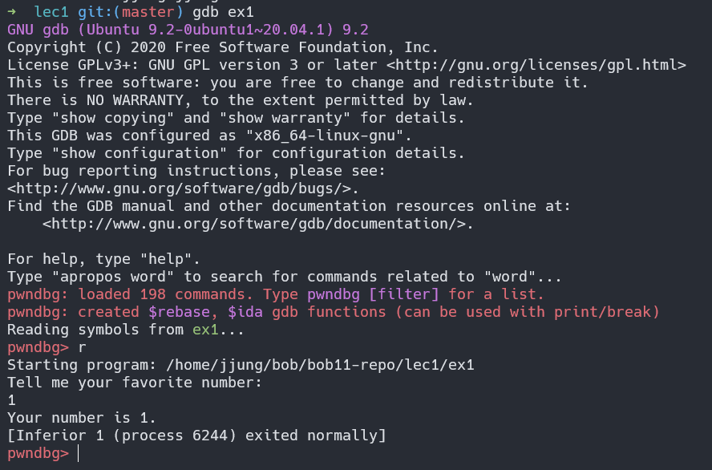
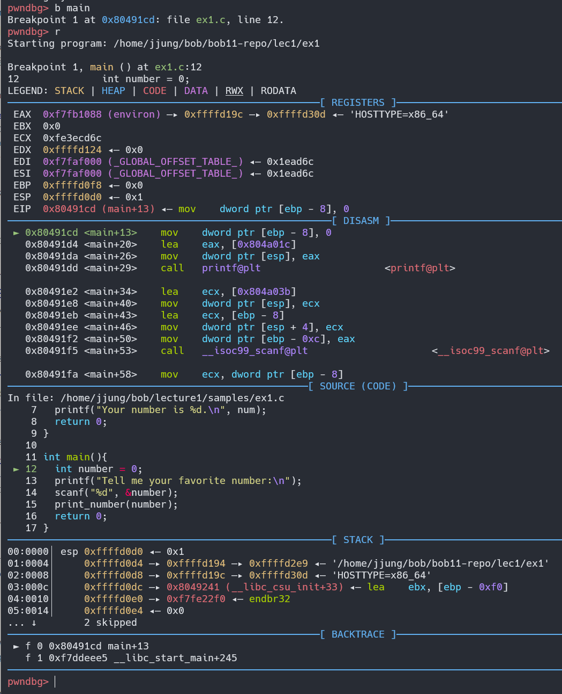

Lec1 Tutorial
==============

## pwndbg를 활용한 바이너리 실행

pwndbg를 설치하면 gdb wrapper가 여러분의 홈디렉토리에 생성됩니다. (~/.gdbinit 파일을 체크해보세요). wrapper를 통해 기존 gdb 명령어를 실행할 수 있고, 새롭게 편리한 명령들을 실행할수도 있습니다. 디버거를 구동시키는 방법은 아래와 같습니다.

```sh
$ gdb [binary name]
```

구동시키면 아래와 같은 화면이 나올 겁니다. 단순히 `r` 또는 `run` 명령으로 프로세스를 실행시킬 수 있습니다.



디버깅, 특히 pwndbg wrapper의 장점은 context를 보여주는 방식입니다. 아래의 그립을 보면 매 instruction마다 한페이지에 가까운 정보를 보여주는 것을 알 수 있습니다.

* register들
* instruction
* 소스코드 (심볼이 있는 경우)
* stack



pwndbg에 대한 다양한 기능을 배우고 싶으면 다음 링크를 참조하시지 바랍니다 [(여기)](https://github.com/pwndbg/pwndbg/blob/dev/FEATURES.md).

관심이 있다면 아래의 기능을 스스로 사용해보시기 바랍니다.

| Command       | Description                                               |
|---------------|-----------------------------------------------------------|
|`aslr`         | Inspect or modify ASLR status                             |
|`checksec`     | Prints out the binary security settings using `checksec`. |
|`elfheader`    | Prints the section mappings contained in the ELF header.  |
|`hexdump`      | Hexdumps data at the specified address (or at `$sp`).     |
|`main`         | GDBINIT compatibility alias for `main` command.           |
|`nearpc`       | Disassemble near a specified address.                     |
|`nextcall`     | Breaks at the next call instruction.                      |
|`nextjmp`      | Breaks at the next jump instruction.                      |
|`nextjump`     | Breaks at the next jump instruction.                      |
|`nextret`      | Breaks at next return-like instruction.                   |
|`nextsc`       | Breaks at the next syscall not taking branches.           |
|`nextsyscall`  | Breaks at the next syscall not taking branches.           |
|`pdisass`      | Compatibility layer for PEDA's pdisass command.           |
|`procinfo`     | Display information about the running process.            |
|`regs`         | Print out all registers and enhance the information.      |
|`stack`        | Print dereferences on stack data.                         |
|`search`       | Search memory for bytes, strings, pointers, and integers. |
|`telescope`    | Recursively dereferences pointers.                        |
|`vmmap`        | Print virtual memory map pages.                           |


## 첫 바이너리를 디버깅해보자

### 구동환경 구성

아래의 명령어를 이용하여 파일에 적절한 권한을 부여합시다.

```sh
# add user “lec1”
$ sudo useradd lec1

# generate a flag and grant proper privilege
$ echo "This is my flag" > flag
$ chmod 440 flag
$ sudo chown lec1:lec1 flag

# take care of the binary
$ sudo chown lec1:lec1 ex2
$ sudo chmod 2755 ex2
```

위 명령어를 사용하여 `lec1` 사용자만 flag를 읽을 수 있게 하였습니다. `ls` 명령어를 사용하여 파일의 소유자와 privilege를 확인할 수 있습니다.

```
$ ls -als

total 112
 4 drwxr-xr-x 3 jjung jjung  4096 Jul 18 05:14 .
 4 drwxr-xr-x 5 jjung jjung  4096 Jul 18 04:20 ..
 4 -rw-r--r-- 1 jjung jjung    13 Jul 12 06:37 .gitignore
 4 -rw-r--r-- 1 jjung jjung   189 Jul 12 05:43 Makefile
16 -rwxr-xr-x 1 jjung jjung 16368 Jul 12 05:43 ex1
 4 -rw-r--r-- 1 jjung jjung   310 Jul 12 05:43 ex1.c
20 -rwxr-sr-x 1 lec1  lec1  16620 Jul 12 05:43 ex2
 4 -rw-r--r-- 1 jjung jjung   445 Jul 12 05:43 ex2.c
16 -rwxr-xr-x 1 jjung jjung 16140 Jul 12 05:43 ex3
 4 -rw-r--r-- 1 jjung jjung   169 Jul 12 05:43 ex3.c
20 -rwxr-xr-x 1 jjung jjung 16804 Jul 12 05:43 ex4
 4 -r--r----- 1 lec1  lec1     16 Jul 18 05:13 flag
 4 drwxr-xr-x 2 jjung jjung  4096 Jul 18 04:54 img
 4 -rw-r--r-- 1 jjung jjung  4043 Jul 18 05:13 tutorial.md
```

flag파일의 경우 소유자는 `lec1`이며 runtime 실행모드는 `-r--r-----` 입니다.

* 첫번째 `-`: 디렉토리 여부
* 두번째 `r--`: 파일의 소유자는 해당 파일을 읽을 수 있음
* 세번째 `r--`: 해당 그룹에 속하는 user는 파일을 읽을 수 있음
* 네번째 `---`: 그 밖에 다른 사람들은 아무것도 할 수 없음

여기서 특이한 것은 ex2 바이너리의 경우 `-rwxr-sr-x`로 표시되어 있습니다. 이것이 가리키는 의미는 아래와 같습니다.

* 파일 소유자: r/w/x를 할 수 있는 권한이 있음
* 그룹멤버: r/x를 할 수 있음, 그리고 해당 파일을 실행하는 동안 그룹멤버의 privilege를 가지게 됨
* 그 밖의 다른 사람들은 r/x의 권한을 가짐


### ex2.c 소스코드


```c
#include <stdio.h>
#include <string.h>
#include <stdlib.h>
#include <unistd.h>

void spawn_shell(){
        printf("There you are!\n");
        setregid(getegid(), getegid());
        execl("/bin/bash", "bash", NULL);
}

int main(){
        char buf[512];
        printf("What is your password?\n");
        scanf("%s", buf);
        if(strcmp(buf, "Password") == 0){
                printf("Correct!\n");
                spawn_shell();
        }
        else{
                printf("Wrong password!\n");
        }
        return 0;
}
```

소스코드부터 봅시다. 매우 단순합니다. 우선 `scanf()` 함수에서 buf로 문자열을 받습니다. `strcmp()` 함수에서 만약 사용자의 입력값이 `Password` 인 경우 `spawn_shell()` 함수를 실행합니다. 또한 호출된 함수에서는 "/bin/sh" 을 실행합니다.

ex2 바이너리의 경우 해당 바이너리를 실행하는 동안 ex2 그룹이 가지는 권한을 얻을 수 있기 때문에 spawn된 쉘에서는 flag를 읽을 수 있습니다. 이런 식으로 특수한 권한을 가진 바이너리를 이용하여 flag를 읽는 방식으로 많은 CTF대회가 운영됩니다.


```sh
$ cat flag
cat: flag: Permission denied

$ ./ex2
What is your password?
Password
Correct!
There you are!

~/bob/bob11-repo/lec1$ cat flag
This is my flag
```


### pwngdb로 ex2 바이너리 instruction 따라가보기

먼저 main함수를 봅시다. `disas` 명령어를 사용하여 disassembled instruction들을 볼 수 있습니다.

```sh
pwndbg> disas main
Dump of assembler code for function main:
   0x08049230 <+0>:     push   ebp
   0x08049231 <+1>:     mov    ebp,esp
   0x08049233 <+3>:     sub    esp,0x218
   0x08049239 <+9>:     mov    DWORD PTR [ebp-0x4],0x0
   0x08049240 <+16>:    lea    eax,ds:0x804a022
   0x08049246 <+22>:    mov    DWORD PTR [esp],eax
   0x08049249 <+25>:    call   0x8049050 <printf@plt>
   0x0804924e <+30>:    lea    ecx,[ebp-0x204]
   0x08049254 <+36>:    lea    edx,ds:0x804a03a
   0x0804925a <+42>:    mov    DWORD PTR [esp],edx
   0x0804925d <+45>:    mov    DWORD PTR [esp+0x4],ecx
   0x08049261 <+49>:    mov    DWORD PTR [ebp-0x208],eax
   0x08049267 <+55>:    call   0x80490a0 <__isoc99_scanf@plt>
   0x0804926c <+60>:    lea    ecx,[ebp-0x204]
   0x08049272 <+66>:    mov    edx,esp
   0x08049274 <+68>:    mov    DWORD PTR [edx],ecx
   0x08049276 <+70>:    mov    DWORD PTR [edx+0x4],0x804a03d
   0x0804927d <+77>:    mov    DWORD PTR [ebp-0x20c],eax
   0x08049283 <+83>:    call   0x8049040 <strcmp@plt>
   0x08049288 <+88>:    cmp    eax,0x0
   0x0804928b <+91>:    jne    0x80492af <main+127>
   0x08049291 <+97>:    lea    eax,ds:0x804a046
   0x08049297 <+103>:   mov    DWORD PTR [esp],eax
   0x0804929a <+106>:   call   0x8049050 <printf@plt>
   0x0804929f <+111>:   mov    DWORD PTR [ebp-0x210],eax
   0x080492a5 <+117>:   call   0x80491d0 <spawn_shell>
   0x080492aa <+122>:   jmp    0x80492bd <main+141>
   0x080492af <+127>:   lea    eax,ds:0x804a050
   0x080492b5 <+133>:   mov    DWORD PTR [esp],eax
   0x080492b8 <+136>:   call   0x8049050 <printf@plt>
   0x080492bd <+141>:   xor    eax,eax
   0x080492bf <+143>:   add    esp,0x218
   0x080492c5 <+149>:   pop    ebp
   0x080492c6 <+150>:   ret
End of assembler dump.
```

특히 main함수의 가장 첫 부분과 마지막 부분은 `function prologue`와 `function epilogue`로 불립니다. `function prologue`는 현재의 base pointer를 push하며 (`push ebp`) 나중에 함수가 끝날때 `function epilogue`에서 복구합니다. 이후 base pointer는 현재 stack pointer의 주소를 가지게 됩니다. 그래서 base pointer는 스택의 가장 끝을 가리키지요 (`mov ebp, esp`). 그 다음으로 지역변수들이 들어갈 수 있는 공간을 만들어주기 위해 stack pointer 값이 줄어들게 됩니다 (`sub esp, N`). `function epilogue`에서는 `function prologue`와 정반대되는 일을 합니다.

```sh
   0x08049230 <+0>:     push   ebp
   0x08049231 <+1>:     mov    ebp,esp
   0x08049233 <+3>:     sub    esp,0x218
   ...
   0x080492bf <+143>:   add    esp,0x218
   0x080492c5 <+149>:   pop    ebp
   0x080492c6 <+150>:   ret
```

첫번재로 `printf` 함수가 호출됩니다. 다음 instruction을 봅시다.

```sh
   0x08049240 <+16>:    lea    eax,ds:0x804a022
   0x08049246 <+22>:    mov    DWORD PTR [esp],eax
   0x08049249 <+25>:    call   0x8049050 <printf@plt>
```

`LEA`는 Load Effective Address 명령입니다. 좌변 레지스터에 우변의 주소값을 저장하는 명령입니다. `lea eax,ds:0x804a022` 가 실행되면 주소값인 `0x804a022` 자체가 eax레지스터에 저장됩니다. 그 다음으로 eax 레지스터에 저장된 값 (주소)이 스택의 최상단에 위치하게 됩니다. push가 아니라 `mov DWORD PTR [esp],eax` instruction이기 때문에 스택 최상단에 있는 값을 덮어쓰게 됩니다. 마지막으로 `printf()` 함수가 호출됩니다 (`call   0x8049050 <printf@plt>`). 현재는 32bit 바이너리이기 때문에 calling convention은 스택을 통해 함수호출 인자값을 전달하는 방식을 취합니다. 스택의 가장 끝부분에 함수의 첫번째 인자가 위치합니다. 그렇다면 인자로 넘어갔던 `0x804a022`에는 무엇이 있었을까요?

```sh
pwndbg> x/x 0x804a022
0x804a022:      0x74616857
pwndbg> x/s 0x804a022
0x804a022:      "What is your password?\n"
```

`x/x`명령으로 16진수로 표시했더니 `0x74616857`가 쓰여있는데 범위가 Ascii 캐릭터 같습니다. `x/s` 명령으로 확인하니 string을 볼 수 있습니다. 이는 소스코드의 `printf("What is your password?\n");` 부분과 같습니다.


다음은 scanf() 함수입니다.

```sh
   0x0804924e <+30>:    lea    ecx,[ebp-0x204]
   0x08049254 <+36>:    lea    edx,ds:0x804a03a
   0x0804925a <+42>:    mov    DWORD PTR [esp],edx
   0x0804925d <+45>:    mov    DWORD PTR [esp+0x4],ecx
   0x08049261 <+49>:    mov    DWORD PTR [ebp-0x208],eax
   0x08049267 <+55>:    call   0x80490a0 <__isoc99_scanf@plt>
```

먼저 지역변수 (소스코드에서는 buf) 주소를 `ecx`에 assign하고 이후 해당 값은 stack의 최상단에서 두번째에 위치합니다 (`lea ecx,[ebp-0x204]` + `mov DWORD PTR [esp+0x4],ecx`). `0x804a03a` 주소값을 `edx`에 저장한 후 (`lea  edx,ds:0x804a03a`), stack의 최상단에 해당 값이 위치하게 됩니다 (`mov DWORD PTR [esp],edx`). 이후 `scanf()`가 호출되면 첫번째 인자로 `0x804a03a` 주소값, 두번째 인자로 지역변수의 주소가 전달되게 됩니다. `0x804a03a` 주소에는 `%s` 라는 format string이 들어있습니다.

```sh
pwndbg> x/s 0x804a03a
0x804a03a:      "%s"
```

마지막으로 `strcmp()` 함수 호출이 어떻게 처리되는지 봅시다. 함수의 인자값이 전달되는 것은 `scanf()`와 동일하기 때문에 생략합니다. 여기서는 `strcmp()` 호출 이후 if-else 조건이 처리되는 방법을 확인합니다.

```sh
   0x08049283 <+83>:    call   0x8049040 <strcmp@plt>
   0x08049288 <+88>:    cmp    eax,0x0
   0x0804928b <+91>:    jne    0x80492af <main+127>
   0x08049291 <+97>:    lea    eax,ds:0x804a046
   0x08049297 <+103>:   mov    DWORD PTR [esp],eax
   0x0804929a <+106>:   call   0x8049050 <printf@plt>
   0x0804929f <+111>:   mov    DWORD PTR [ebp-0x210],eax
   0x080492a5 <+117>:   call   0x80491d0 <spawn_shell>
   0x080492aa <+122>:   jmp    0x80492bd <main+141>
   0x080492af <+127>:   lea    eax,ds:0x804a050
   0x080492b5 <+133>:   mov    DWORD PTR [esp],eax
   0x080492b8 <+136>:   call   0x8049050 <printf@plt>
```

소스코드는 아래와 같으니 같이 비교하시기 바랍니다.

```c
        if(strcmp(buf, "Password") == 0){
                printf("Correct!\n");
                spawn_shell();
        }
        else{
                printf("Wrong password!\n");
        }
```

먼저 `strcmp()` 함수는 `eax` 레지스터에 저장된 상태로 리턴이 됩니다. `cmp` 명령은 리턴된 값과 0x0값을 비교하게 되는데 이때 `cmp` 명령의 결과가 같지 않다면 (not equal) `0x80492af`로 점프(`jne 0x80492af <main+127>`)하게 됩니다. 실제 `cmp` instruction은 두 값을 비교하는 것이 아니라 빼기 연산을 수행하고 결과를 ZF/CF flag에 저장하는 것입니다. `jne`는 이 flag들의 값을 보고 같은지 좌변/우변이 같았는지 알수 있습니다. 아무튼, 현재 부분은 소스코드의 else 조건에 해당합니다. `0x80492b5`로 점프하게 되면 `Wrong password`라는 메시지를 `printf()` 함수를 통해 출력하고 프로그램이 종료되게 됩니다.

만약 `cmp` 명령의 결과가 같다면 `jne 0x80492af <main+127>`를 통해 jump하지 않습니다. 대신에 바로 다음 명령인 `lea eax,ds:0x804a046`가 실행되게 됩니다. 쭉 따라가다 보면 shell을 spawn한 이후 `jmp    0x80492bd <main+141>`에서 프로그램이 종료되는 위치로 한번 더 jump를 하는 것을 알 수 있습니다. 이는 else 컨디션에서 실행될 코드를 건너뛰는 역할을 합니다.

### pwndbg로 ex3 바이너리 따라가보기


loop가 instruction-level에서는 어떻게 표현되는지 학습하기 위한 예제입니다. instruction 단위로 따라가면서 loop 카운터가 어떻게 처리되고 jump operation이 어떤 국면에서 발생하는지 쉽게 확인할 수 있을 겁니다.


```c
#include <stdio.h>
#include <string.h>
#include <stdlib.h>
#include <unistd.h>

int main(){
        int i;
        for (i=0; i<10; i++)
                printf("%d\n", i);
        return 0;
}
```

```sh
   0x08049180 <+0>:     push   ebp
   0x08049181 <+1>:     mov    ebp,esp
   0x08049183 <+3>:     sub    esp,0x18
   0x08049186 <+6>:     mov    DWORD PTR [ebp-0x4],0x0
   0x0804918d <+13>:    mov    DWORD PTR [ebp-0x8],0x0
   0x08049194 <+20>:    cmp    DWORD PTR [ebp-0x8],0xa
   0x08049198 <+24>:    jge    0x80491c1 <main+65>
   0x0804919e <+30>:    mov    eax,DWORD PTR [ebp-0x8]
   0x080491a1 <+33>:    lea    ecx,ds:0x804a008
   0x080491a7 <+39>:    mov    DWORD PTR [esp],ecx
   0x080491aa <+42>:    mov    DWORD PTR [esp+0x4],eax
   0x080491ae <+46>:    call   0x8049040 <printf@plt>
   0x080491b3 <+51>:    mov    eax,DWORD PTR [ebp-0x8]
   0x080491b6 <+54>:    add    eax,0x1
   0x080491b9 <+57>:    mov    DWORD PTR [ebp-0x8],eax
   0x080491bc <+60>:    jmp    0x8049194 <main+20>
   0x080491c1 <+65>:    xor    eax,eax
   0x080491c3 <+67>:    add    esp,0x18
   0x080491c6 <+70>:    pop    ebp
   0x080491c7 <+71>:    ret
```


## Control-flow Hijacking 실습

control-flow hijacking을 할 준비가 되었습니다. ex4 바이너리를 사용하면 됩니다. 실습목적상 ex4 바이너리의 소스코드는 제공하지 않습니다.

`ex4` 바이너리를 가지고 control-flow를 hijack 해 봅시다. 우리의 목표는 `impossible_trigger()` 함수를 호출하는 것입니다. 현재 정의된 `global_var` 변수가 있고 초기값은 0이 입력되어 있습니다. 코드내부에 `global_var`를 변경하는 부분이 없기 때문에, 정상적인 실행흐픔에서는 `impossible_trigger()` 함수가 호출될 수 없습니다. 하지만 memory corruption 취약점을 활용해서 `impossible_trigger()` 함수를 호출할 수 있습니다.

먼저 main() 함수의 instruction들입니다. 그다지 흥미로운 것은 없습니다.

```sh
   0x08049240 <+0>:     push   ebp
   0x08049241 <+1>:     mov    ebp,esp
   0x08049243 <+3>:     sub    esp,0x8
   0x08049246 <+6>:     mov    DWORD PTR [ebp-0x4],0x0
   0x0804924d <+13>:    call   0x80491d0 <receive_input>
   0x08049252 <+18>:    cmp    DWORD PTR ds:0x804c048,0x0
   0x08049259 <+25>:    je     0x8049264 <main+36>
   0x0804925f <+31>:    call   0x80491a0 <impossible_trigger>
   0x08049264 <+36>:    xor    eax,eax
   0x08049266 <+38>:    add    esp,0x8
   0x08049269 <+41>:    pop    ebp
   0x0804926a <+42>:    ret
```

다음으로 receive_input() 함수의 instruction들입니다. 뭔가 memory corruption을 성공시킬 수 있을 것 같군요.

```sh
   0x080491d0 <+0>:     push   ebp
   0x080491d1 <+1>:     mov    ebp,esp
   0x080491d3 <+3>:     sub    esp,0x38
   0x080491d6 <+6>:     mov    DWORD PTR [ebp-0x4],0x41414141
   0x080491dd <+13>:    mov    DWORD PTR [ebp-0x8],0x42424242
   0x080491e4 <+20>:    mov    eax,DWORD PTR [ebp-0x4]
   0x080491e7 <+23>:    mov    ecx,DWORD PTR [ebp-0x8]
   0x080491ea <+26>:    lea    edx,ds:0x804a02c
   0x080491f0 <+32>:    mov    DWORD PTR [esp],edx
   0x080491f3 <+35>:    mov    DWORD PTR [esp+0x4],eax
   0x080491f7 <+39>:    mov    DWORD PTR [esp+0x8],ecx
   0x080491fb <+43>:    call   0x8049040 <printf@plt>
   0x08049200 <+48>:    lea    ecx,ds:0x804a053
   0x08049206 <+54>:    mov    DWORD PTR [esp],ecx
   0x08049209 <+57>:    mov    DWORD PTR [ebp-0x20],eax
   0x0804920c <+60>:    call   0x8049040 <printf@plt>
   0x08049211 <+65>:    lea    ecx,[ebp-0x1c]
   0x08049214 <+68>:    mov    edx,DWORD PTR ds:0x804c040
   0x0804921a <+74>:    mov    DWORD PTR [esp],ecx
   0x0804921d <+77>:    mov    DWORD PTR [esp+0x4],0x80
   0x08049225 <+85>:    mov    DWORD PTR [esp+0x8],edx
   0x08049229 <+89>:    mov    DWORD PTR [ebp-0x24],eax
   0x0804922c <+92>:    call   0x8049050 <fgets@plt>
   0x08049231 <+97>:    add    esp,0x38
   0x08049234 <+100>:   pop    ebp
   0x08049235 <+101>:   ret
```


```sh

------------------------
 return_address
 (of receive_input())
------------------------
 saved EBP
------------------------
 0x41414141
------------------------
 0x42424242
------------------------
  ^
 buf
  v
------------------------
```

우리가 해야 할 것은 buf부터 시작해서 return address까지 overwrite를 시킨 다음, 함수가 return할 때 `impossible_trigger()` 함수가 호출되도록 하는 것입니다. 그래서 return address를 `impossible_trigger()` 주소로 덮어쓰기 하는 것이 중요합니다.

가장 쉽게는 입력값으로 `AAAABBBBCCCCDDDDEEEEFFFFGGGGHHHHIIIIJJJJKKKKLLLL...` 와 같이 길지만 내용이 구분되는 값을 보내보는 겁니다. 그렇게 해서 함수가 return 했을 때 0x45454545로 EIP가 바뀌었다면 return address를 0x45454545로 덮어썼다는 의미입니다. instruction들을 자세히 관찰하여 buf 크기를 역산한 후 한번에 정확한 exploit을 작성할 수도 있습니다.

만약 exploit에 성공했다면 프로그램이 crash되지 않고 /bin/sh이 실행된 프롬프트를 볼 수 있을 겁니다.